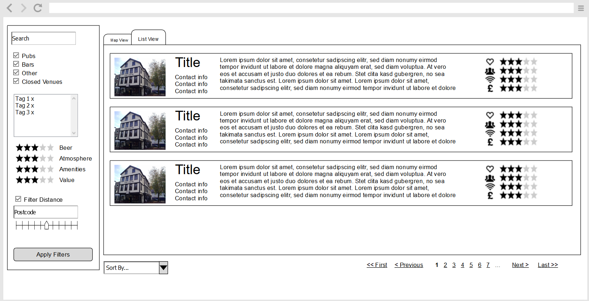
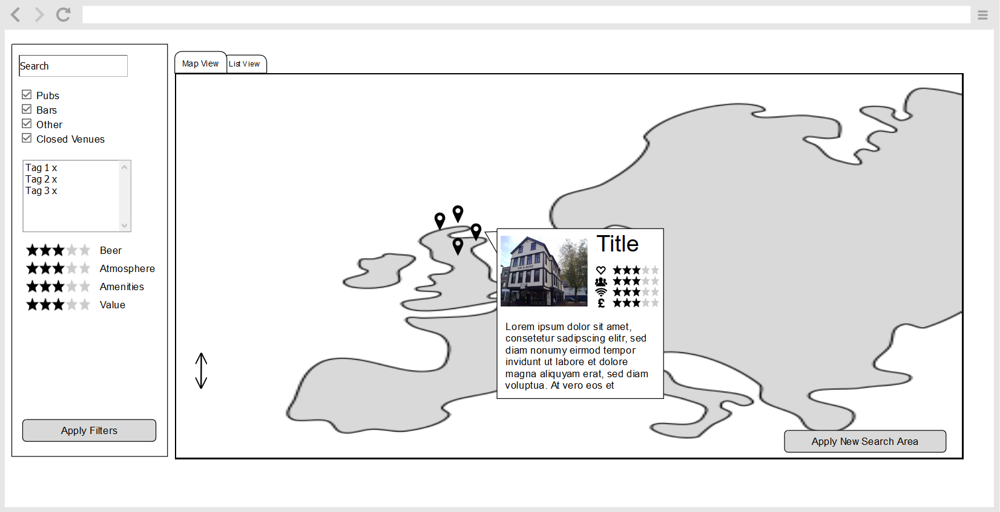

# Overview
This document outlines how I decided to take on the Leeds Beer Quest challenge and covers some technical information for the demo app. First, I'll cover the approach I decided to take, followed by the design choices I've made. Then, I've outlined a potential future roadmap for extending scope and functionality. 

The final part of the document covers the usual README content, requirements and instructions for running locally, as well as the API description. 
# Approach
I wanted to tackle the exercise in a way that would allow me to demonstrate not just my ability to write code, but also to architect a solution and manage a project. To do this I've approached the problem as if I were developing the tool into a full product, using an extensible architecture, focusing on an MVP and identifying potential future features.

# Design
## UI
The first thing I designed was the UI. As this is a user facing tool, the UI and UX are key. Having the freedom to design the UI first allows us to create a user-focused experience. The wireframe can be seen here: 



I've opted for simple design, taking inspiration from sites such as RightMove, with a list view to allow for sorting data and a map view for a better sense of area.

I would build this as a SPA, the majority of components created using bootstrap and the map pulled from google-map-react, which is a react library built to interact with the Google Maps API.

<!-- For the MVP, there will be two required endpoints. `GET FilterInformation` required to populate the sidebar and `GET Venues` which gets relevant user data to display. Initially, the two views will receive the same set of data and the frontend will handle how to display them. This will allow the users to look though the data without needing frequent API requests to get the next page. There is a risk though of the initial loading of data taking too long, in which case we can update the api to have `GET ListView`, `GET MapView` and `GET Venue`. The list view requesting paginated data and the map view only fetching location data and ID, allowing for the rest to be requested once clicked. This data can be cached to allow for faster loading. -->
<!-- Move TO Backend section-->
From the design above, there will be two required enpoints....
One of which I have built as an example in the demo app... 

## Backend
### API Design
The proposed UI design will require 3 endpoints `GET FilterInformation` to populate the sidebar, `GET Venues` to populate the list/map and `GET GoogleApiKey` to fetch the Google maps API key stored in a backend KeyVault for security.

This design uses both `GET Venues` for the list and map view, which returns all data matching the filter. This allows users to switch between pages, views and venues without having to wait for data to be fetched from the backend each time. Caching could alleviate this issue, but a user's first visit to the site could seem sluggish. However, there is a chance that `GET Venues` will be returning too much data up front causing initial load times to be too long. In which case I would pivot to have `GET ListView`, `GET MapView` and `GET Venue`. `GET ListView` would paginate the data on the backend. `GET MapView` would return only location and name data in order to place the points on the map. `GET Venue` would be then called whenever a user clicked on a specific venue to get the rest of the information for the callout. Again, this data can be cached to allow for faster loading if a user is flicking back and forth between venues or pages.

The benefit of this approach is that the initial design is far simpler, allowing for a quicker development cycle. Should the need to pivot arise, the initial work is not wasted, as it needs only be expanded upon to get to the second option.  

### Architecture
For the backend, I've used a Domain-Driven Vertical Slice architecture. I've chosen to use vertical slices, because they decouple each individual request. I find this extremely useful for agile development, as it allows us to be as lean as possible while still avoiding technical debt. 

One place I've moved away from textbook vertical slices is by using a repository pattern. This is because it makes it make it easy to change the out data infrastructure, should a future feature need it. This, along with the mediator pattern, means that dependencies are injected across all layers of the application, making it easily testable with mocked interface realisations. 

### Testing
I use two types of test when creating CRUD applications. The first is a traditional unit tests, which test the inputs, outputs and exception cases of all public functions in the Core and Application layers, using Moq to mock the injected classes. The second type would be functional tests, which can test and request end-to-end and ensure that the right data and HTTP response types are returned.

Due to time constraints, I have not fully built out the tests into the demo solution. However, I have included some examples.

These tests can also be automated in a CICD pipeline, ensuring all pushed code returns the expected results. 

## Infrastructure
Due to the nature of the application, I thought low running costs would be a priority when it came to choosing infrastructure. Because of this, I've decided to use serverless infrastructure in the form of Azure Functions which provides a straightforward way to host a SPA as well as table storage for the data.

This can be easily integrated with CICD pipelines to enable simple deployment. 

# Roadmap 
Here I've outlined additional features that would be part of the MVP, along with some potential future epics. 

- Epic: MVP - The MVP covers the basic presentation of filterable data to an end user. 
    - Feature: Data Management
        - Story: Upload CSV
    - Feature: List View
        - Story: Filter Sidebar
        - Story: Venue List
    - Feature: Map View
        - Story: Venue map
        - Story: Map View Filter
- Epic: Metrics - Adding a system to collect user metrics will allow us to see how the product is being used, and shape the future roadmap of the tool. Examples of what we could focus on are where people are when they are using the tool, and popular search filters or areas. 
    - Feature: Metrics Collection
        - Story: Metrics Enablement - Build out the necessary framework to capture metrics
        - Story: GeoLocation Metrics
        - Story: Filter Metrics
    - Feature: Metrics Views
        - Story: Metrics Dashboard
- Epic: Contributors & Admins - With an increasing userbase, it may be necessary to add contributors to manage the dataset, and admins to manage those users. 
    - Feature: User Accounts
        - Story: User Auth
        - Story: User Roles
        - Story: User Management
    - Feature: Data Management
        - Story: Create Venues
        - Story: Update Venues
        - Story: Remove venues
    - Feature: ChangeLog
        - Story: Event Sourcing
        - Story: Display Changes    

# Running the Program
## Requirements
- [Azure Storage Emulator](https://docs.microsoft.com/en-us/azure/storage/common/storage-use-emulator)
- [Azure Functions Core Tools V3.x](https://github.com/Azure/azure-functions-core-tools)
- Visual Studio 2019
## Debugging
To Run the program, simply run the BeerQuest.Functions project from within Visual Studio. The functions SDK will automatically start up to the storage emulator, and a triggered function has been built to create populate the table on startup for the purpose of this exercise.
## Api Definition
### GetVenues 
#### Request
```
GET /api/GetVenues
```
#### Query Parameters
Note: All parameters are optional. If a parameter is not sent, that filter is not applied
 Name | Type | Description | Restrictions 
 ---|---|---|---
MinBeer |int| Minimum rating for Beer| between 0 and 5
MinAtmosphere|int|Minimum rating for Atmosphere| between 0 and 5
MinAmenities|int|Minimum rating for Amenities| between 0 and 5
MinValue|int|Minimum rating for Value| between 0 and 5
MinLat|double|Minimum Latitude Value| between -90 and 90, less than MaxLat
MaxLat |double|Maximum Latitude Value|between -90 and 90
MinLng|double|Minimum Longitude Value| between -180 and 180, less than MaxLng
MaxLng|double|Maximun Longitude value|between -180 and 180
Lat|double|Used in conjunction with Lng and MaxDistKm to specify a maximum distance from a coordinate |between -90 and 90
Lng|double|Used in conjunction with Lat and MaxDistKm to specify a maximum distance from a coordinate|between -180 and 180
MaxDistKm|int|Maximum distance in KM allowed from Lat and Lng coordinate| not 0
Category|string|Filters out any venues which do not match this category (ignoring case)|
NameSearch|string|Filters out any venues that who's names don't contain this string|
tags|string|Comma separated tags. Filters out any venues which don't have at least one of these tags|

#### Response Body
```
{
        "name": "",
        "category": "",
        "url": "",
        "date": "",
        "thumbnail": "",
        "lat": 0,
        "lng": 0,
        "address": "",
        "phone": "",
        "twitter": "",
        "beer": 0,
        "atmosphere": 0,
        "amenities": 0,
        "value": 0,
        "tags": [
            ""
        ]
    },
```
